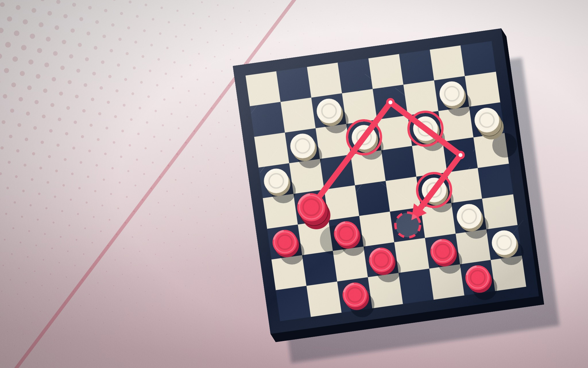
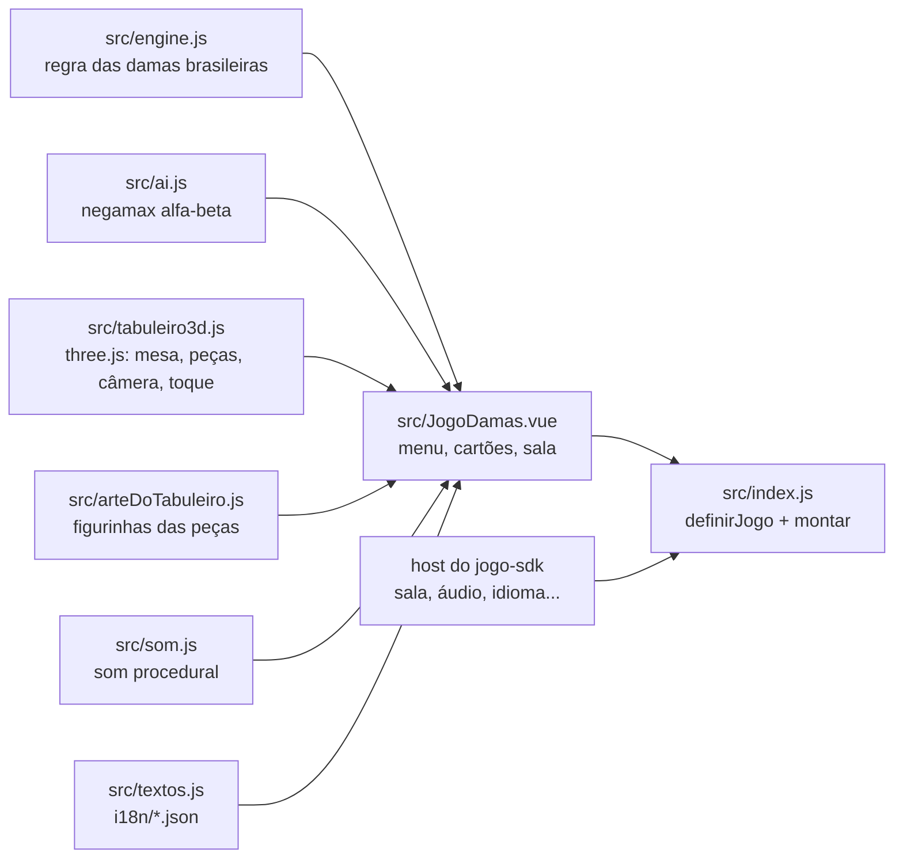

# Damas

As damas do [RoqueOS](https://roqueos.com.br), na regra brasileira e em 3D: contra a IA, com
um amigo no mesmo aparelho, ou online por código e QR. Jogue em
[roqueos.com.br/jogar/damas](https://roqueos.com.br/jogar/damas).

_English below._

## Por que existe

Até 25/09/2026 este jogo morava dentro do repositório do RoqueOS e importava as stores do
sistema e o Firebase direto. Agora ele é um repo próprio na organização
[roqueos-games](https://github.com/roqueos-games), aberto, e fala com o RoqueOS só pelo
[`jogo-sdk`](https://github.com/roqueos-games/jogo-sdk), inclusive na partida online. O mesmo
código roda no RoqueOS, sozinho no seu navegador (`yarn dev`) e no teste.

## Como se joga

Tabuleiro de 8×8, peças nas casas escuras, as claras começam. A pedra anda uma casa na
diagonal para a frente e come para a frente ou para trás, saltando a peça do outro para a
casa vazia logo depois. A captura é obrigatória, e vale a sequência que come mais peças. A
pedra que chega à última fileira vira dama, que anda e come a qualquer distância na diagonal.
Perde quem fica sem peça ou sem lance.

| Ação                    | Ponteiro (mouse ou toque)               |
| ----------------------- | --------------------------------------- |
| escolher a peça         | clique ou toque na peça, sem arrastar   |
| jogar                   | clique ou toque na casa marcada         |
| girar e inclinar a mesa | arraste                                 |
| aproximar e afastar     | roda do mouse ou pinça com dois dedos   |
| voltar ao menu          | botão × no cartão de cima               |
| entrar numa sala        | digite o código de cinco letras e Enter |

O jogo não usa teclado, fora o campo do código. Quando existe captura, só as peças que podem
comer ficam marcadas, com o aviso "Captura obrigatória".

Contra a IA você escolhe o lado (claras ou escuras) e o nível. A IA procura lances à frente
com poda alfa-beta: dois lances no Fácil, quatro no Médio e seis no Difícil, e erra de
propósito às vezes no Fácil e, bem menos, no Médio. Ela nunca foge de uma captura
obrigatória. As Damas não têm recorde.

## Partida online

Quem cria a sala recebe um código de cinco letras e um QR com o link. O outro jogador entra
pelo código ou abrindo o link, e cada um joga do seu aparelho. Precisa de conta: sem ela, o
jogo avisa e não cria nem entra. A sala mora no host, pela capacidade `sala` do SDK, e não no
jogo; o jogo só manda o tabuleiro e de quem é a vez, no mesmo formato de antes da extração,
para que um RoqueOS antigo ainda aberto do outro lado continue entendendo.

No `yarn dev`, a partida online roda entre duas abas do mesmo navegador: crie a sala numa aba
e abra o link (a própria página com `?sala=<código>`) numa aba nova. Não duplique a aba, que
copia o `sessionStorage` e vira o mesmo jogador.

### Limitações conhecidas

- O convite só chega ao jogo quando a janela abre: o jogo lê o código do link ao montar. Um
  segundo convite, aberto com a janela das Damas já aberta no RoqueOS, não chega ao jogo. Feche
  a janela e abra o link de novo, ou digite o código.
- Sair da partida (o × ou fechar a janela) não encerra a sala: o outro jogador fica esperando
  o seu lance. Era assim antes da extração.
- A queda de conexão de quem criou a sala é marcada na sala (`anfitriaoSaiu`), mas o jogo não
  lê essa marca. Também era assim antes.

## Arquitetura

- `src/engine.js` é a regra, sem Vue e sem DOM: lances legais com captura máxima obrigatória,
  promoção, fim de partida e o `serialize` de 64 casas mais a vez, que é o que atravessa a sala.
- `src/ai.js` é a IA, pura, em cima do gerador de lances do motor.
- `src/tabuleiro3d.js` é a cena em [three.js](https://threejs.org): a mesa de madeira com
  textura pintada em canvas, as peças torneadas, luz e sombra, a câmera que gira com o arraste
  e o raio que acha a casa tocada. No perfil leve ele nasce sem antialias, sem sombra, com pixel
  ratio de até 1,25 e peças com menos gomos.
- `src/arteDoTabuleiro.js` pinta as peças em 2D para os cartões e o menu.
- `src/JogoDamas.vue` é a tela: menu, escolha de lado e nível, cartões dos jogadores, espera da
  sala com QR, entrada por código e fim de partida. Tudo o que vem do sistema (a sala, o nome de
  quem joga, áudio, perfil de aparelho fraco, métrica, aviso, idioma) chega pelo `host`.
- `src/index.js` cria um app Vue próprio dentro do elemento que o host entrega, declara a
  capacidade `sala` e devolve `{ ativar, desmontar }`. Desmontar solta o laço, os ouvintes, a
  observação da sala e o contexto WebGL.
- `jogo.json` é o manifesto: nome e descrição nos dez idiomas, SEO, etiquetas, capa, ícone,
  tamanho de janela, `aceitaConvite` e a capacidade `sala`. O RoqueOS confere que ele bate com o
  catálogo.

O `three` e o `qrcode` são `peerDependencies`: o RoqueOS fornece os dele, e o jogo não traz
outro. As versões exatas em `devDependencies` são as que o RoqueOS instala, para o teste e o
`yarn dev` verem o que o jogador vê.

## Pré-requisitos

- Node 24 (o `.nvmrc` diz), ou 22 no mínimo.
- Yarn 1.22.

## Como rodar

1. `yarn install --ignore-scripts`
2. `yarn dev` e abra o endereço que o Vite mostrar: o jogo roda com o host de
   desenvolvimento do SDK, e a sala online mora no `localStorage`.
3. `yarn verificar` antes de abrir PR: lint, formato, testes e o `jogo check`, o mesmo que o
   CI roda.

O teste roda no jsdom, que não tem WebGL: o `three` é trocado por um dublê
(`test/threeStub.js`). Verde no teste não diz nada sobre o desenho na GPU. Mudança no código
que toca a GPU (`src/tabuleiro3d.js` inteiro: renderer, sombra, materiais, texturas, geometria,
pixel ratio, perfil leve) precisa ser vista num iPhone de verdade antes de subir.

## Estrutura

| Caminho              | O que é                                                                    |
| -------------------- | -------------------------------------------------------------------------- |
| `src/`               | o jogo (motor, IA, tabuleiro 3D, arte, tela, som, ícones, textos, entrada) |
| `i18n/`              | um JSON por idioma, com as mesmas chaves nos dez                           |
| `public/`            | capa e ícone; a origem de cada arquivo está no [ASSETS.md](ASSETS.md)      |
| `test/`              | testes com o host falso do SDK e o dublê do three, sem nada do RoqueOS     |
| `dev/`, `index.html` | o jogo sozinho no navegador, para desenvolver                              |
| `jogo.json`          | o manifesto que o RoqueOS lê                                               |

## Onde ele se encaixa

O RoqueOS instala este repo por uma tag exata e monta o jogo pelo `mount` do SDK, na janela do
desktop e em `/jogar/damas`. Uma mudança aqui só chega ao RoqueOS quando uma tag nova é pinada
lá, depois de revisada. O id `checkers` (a sala mora em `matches/checkers/<código>` no banco),
o formato do tabuleiro que atravessa a sala e os nomes de evento (`game_start`, `game_over`)
não mudam: partidas em andamento, o link dos convites e o histórico de uso dependem deles.

## Licença

MIT, no código e na arte própria. Veja [LICENSE](LICENSE) e [ASSETS.md](ASSETS.md).

---

## English

Brazilian draughts from [RoqueOS](https://roqueos.com.br), in 3D: against the AI, two players
on one device, or online by room code and QR. Capture is mandatory, you must take the line
that captures most, and kings fly any distance along a diagonal. It talks to RoqueOS only
through the [`jogo-sdk`](https://github.com/roqueos-games/jogo-sdk), including the online
match (the `sala` capability), so the same code runs inside RoqueOS, standalone in your
browser and in tests.

- `yarn install --ignore-scripts`, then `yarn dev` to play it locally. Online play works
  between two tabs of the same browser: create a room in one tab and open its link in a new
  tab (do not duplicate the tab).
- `yarn verificar` runs lint, formatting, tests and `jogo check`, exactly like CI.
- Controls are pointer only: tap a piece, then a highlighted square; drag to orbit the board,
  wheel or pinch to zoom. The only keyboard input is the room-code field.
- The AI has three levels (Easy, Medium, Hard) and you pick your side. There is no record.
- Online play needs an account. Known limits: an invite only reaches the game when its window
  opens; leaving a match does not close the room; the host-disconnected flag is not read.
- `three` and `qrcode` are peer dependencies: RoqueOS provides its own copies.
- Tests run in jsdom with a three.js stub, so they say nothing about GPU rendering. Changes to
  `src/tabuleiro3d.js` need to be seen on a real iPhone before they ship.
- Code and comments are in Brazilian Portuguese; issues and pull requests in English are
  welcome.
- The game id `checkers`, the board format sent through the room and the event names
  (`game_start`, `game_over`) are stable on purpose.

MIT licensed, code and original art.
